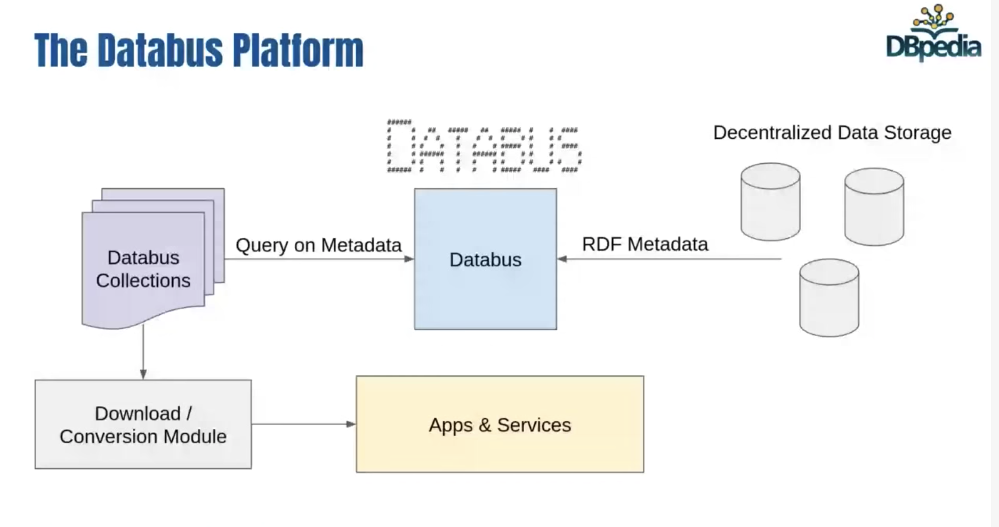

# Databus Resources
Resources for uploading data to the DBpedia Databus and installing DBpedia dockerized Apps.

## How to upload data to the Databus

### 1. Create your Databus account

Go to http://databus.dbpedia.org to create your account.

### 2. Create your WebID
Follow [instructions on how to create your WebID](https://github.com/dbpedia/webid)

### 3. Link you WebID to your Databus account
You must have a WebID and it must be linked to your DBpedia Databus account.

### 4. Install Maven
[Maven](http://maven.apache.org) is used to manage the data build. On MacOS use 'brew install maven'

### 5. Configure pom.xml using the templates in this tutorial
Using the supplied example pom.xml, set your group, artefact, version and license metadata. Create your data folders and configure the public download url for your data.

### 6. Validate
Run 'mvn validate' to check everything is configured properly.

### 7. Deploy
Run 'mvn deploy' to package your data for your server, and upload your data's metadata to the Databus.  Your data gets copied to your own server, and not to the Databus.  Your data  must remain accessible via the public download url set in your pom.xml.

### 8. Contact Artsdata.ca
To let the team at Artsdata.ca know your data is ready, you can add the keyword "artsdata.ca" to your artifact metadata (`:yourdataset1 dcat:keyword "artsdata.ca"`) or simply send an email to mailto:admin@artsdata.ca with your Databus artifact URL and ask to be added to the Artsdata Databus Collection.  If your data passes Artsdata.ca SHACL and data quality considerations, your data will be added to Artsdata and all your future data version updates will be automatically uploaded as well.
